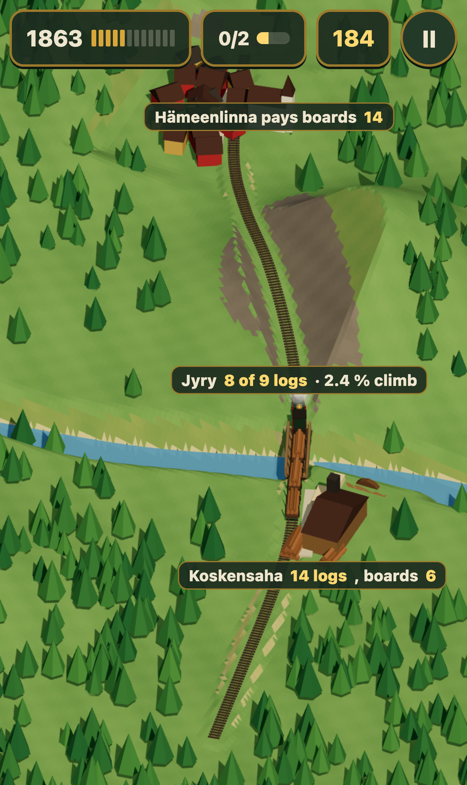
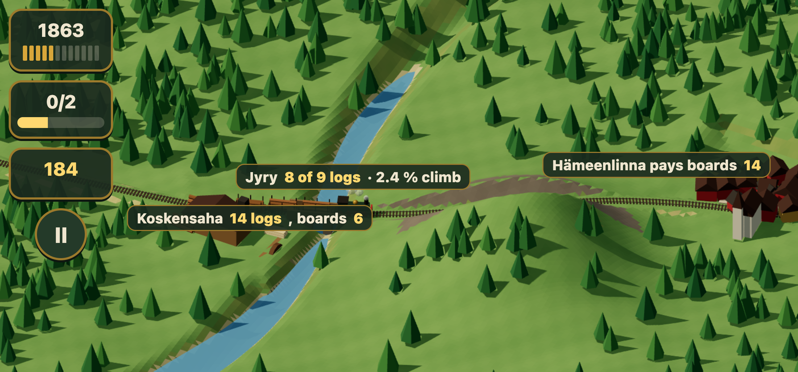
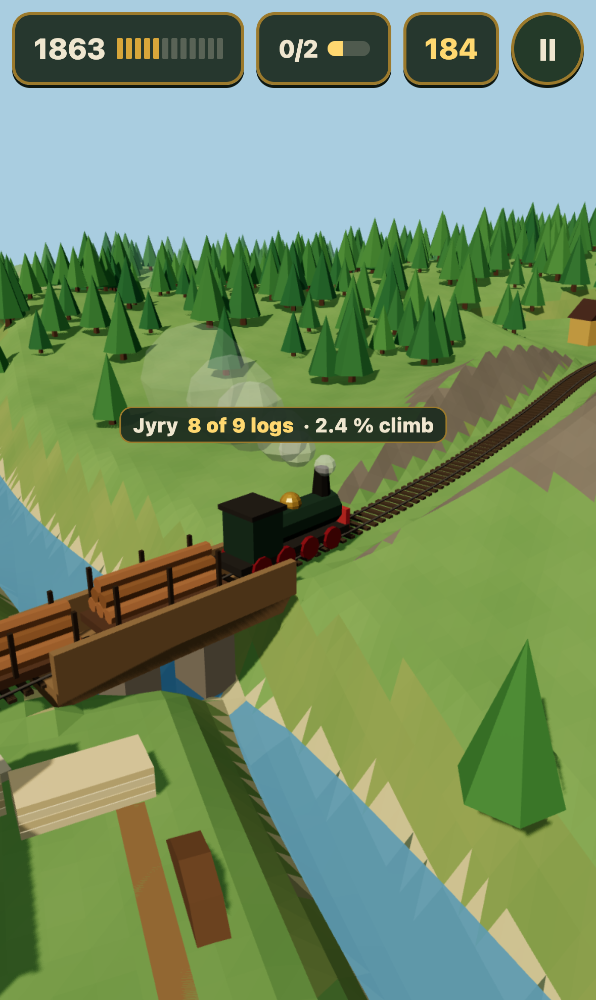
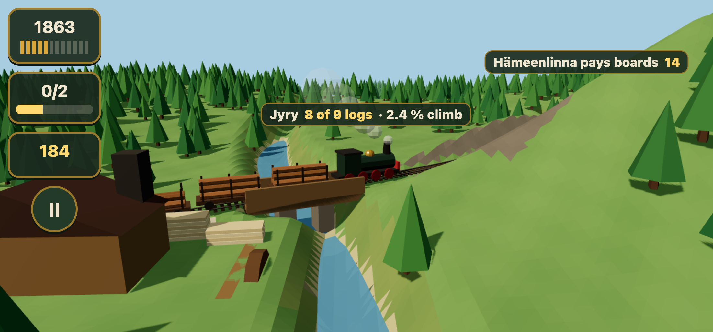

# The 3D look test

History. The 3D map was held on 2026-10-07 in favour of the top-down look
(ADR 0003, `../topdown/`). three is no longer a dependency, so `scene.html`
and `render.mjs` do not run any more; the PNGs are the record.

Vesa on the flat 2D mockups, 2026-10-06: "No, it looks pretty bad. Do we
need to go 3d or isometric? Im looking for the rail building sim experience
but on phone." This folder holds one rendered scene in three.js, two camera
takes, each shot on an iPhone 15 in portrait and landscape by
`render.mjs` (`make scene3d`). It is a look test, no game code: the scene
is built once in `scene.html` and drawn once.

The scene: a valley with a river running north to south, a hill east of it,
a pine forest west and north, the sawmill on the west bank with its log
piles and board stacks, the town beyond the hill with a church, and one
track from the forest edge past the sawmill, over the river on a timber
bridge, along an embankment, through a cutting in the hill's shoulder, and
down to the town station. A train with three log wagons stands at the east
end of the bridge, the last wagon half loaded. The ground is a height field
with one flat colour per face; the embankment sides are sand, the cutting
walls are rock, so both read without a contour line.

What the two takes borrow: low-poly terrain and buildings with hard
shadows from Railway Islands and Mini Motorways, the whole network in one
tilted view from OpenTTD and Railroad Tycoon 3, cuttings and embankments
that the track carves into the ground from Transport Fever 2, and a train
large enough to follow from Train Valley 2.

## Take 1: iso

 

A tilted orthographic camera, 40 degrees down, turned so the line runs up
the screen in portrait and across it in landscape. The whole line fits on
one screen: the player sees the sawmill, the bridge, the hill and the town
at once, and drags between them. Pinch zooms, two fingers turn the view.
The train is small at this distance, so following it means zooming in.

## Take 2: close

 

A perspective camera low over the river, looking along the line toward the
cutting. The train, the bridge piers, the log loads and the board stacks
are the picture; the hill and the town are the depth. This is the view a
tap on a train would give, and the default would then be a zoom between
the two takes rather than a choice of one.

## Not in this scene

Goods chips and the route plate from `../README.md`, water animation,
smoke animation, winter. Each of those sits on top of either take.
