# Mockups for the next build

Six static screens, 2026-10-06, drawn before any game code. They show the
mechanics that `docs/design.md` already has, on a phone, in a form a thumb
can read: height on the map, goods as icons with amounts at every site, a
route under the finger with its grade and cost, a train with its wagons and
load, and the year-end ledger. `make mockups` renders them from
`mockups.html` with Playwright, iPhone 15, portrait and landscape, into
`png/`. Nothing here is game code.

The two things Vesa could not read in the Harju build (2026-10-06), and the
rule each mockup follows:

- **What a site makes and wants.** Every site carries a strip of chips on
  the map at all times. A cream chip is what it has: the good's icon, the
  count, and a bar for the stock against its cap. A dark chip is what it
  wants: the good's icon, what it pays now, and a bar for the price against
  the full price. The bar turns red when the price has fallen to the floor.
  Train Valley 2 does this with a big circle for what a station makes and
  small ones for what it needs, and players say they know "at a glance what
  is needed". OpenTTD hides the same numbers in a station window, and the
  rating formula is the most asked question in its forum.
- **How much hill there is.** The map is a height field. It is drawn as
  colour bands every 12 m (meadow green up through olive and tan to brown
  and grey rock), a contour line every 10 m with a heavier one every 50 m,
  and hill shading with the light from the north west. Transport Fever 2
  players turn its contour layer on to lay track; Railway Empire players say
  "you can usually tell which way is up with contours on". Grade is a
  colour on the track: green under 1.5 %, amber to 3.5 %, red above, with
  chevrons pointing uphill. Railroad Tycoon 2 and 3 show the same three
  colours on the track while it is laid, and Railway Empire players complain
  that the grade is visible only while laying and never after.

## 1. The map at the start

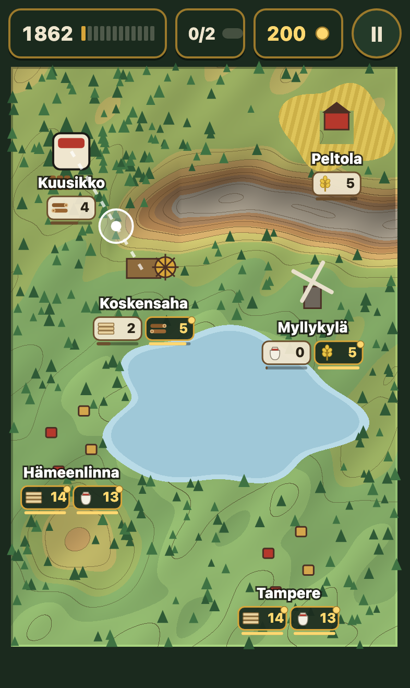 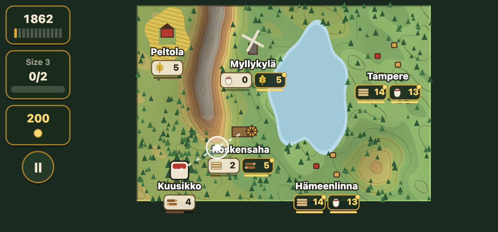

The player decides **what to connect first** with cash for two lines and
two trains. The map answers the questions that decision needs: the farm is
behind the ridge, the forest is on the low side, both towns pay the same
today, the lake splits the map. The hand shows the first drag. No card, no
text.

## 2. A route under the finger

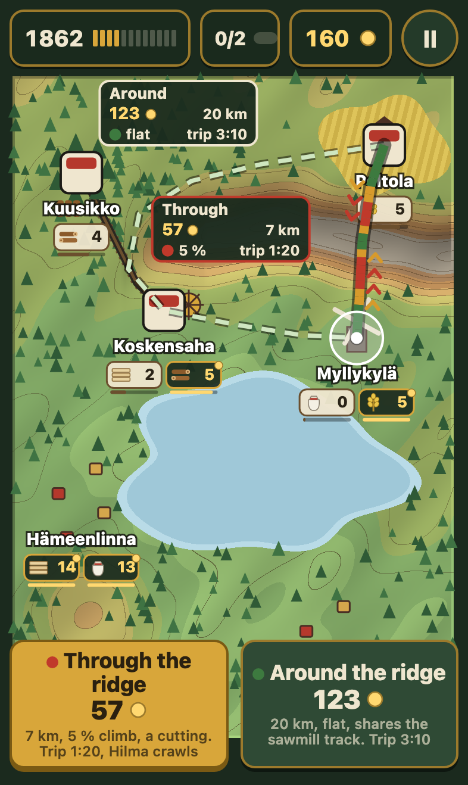 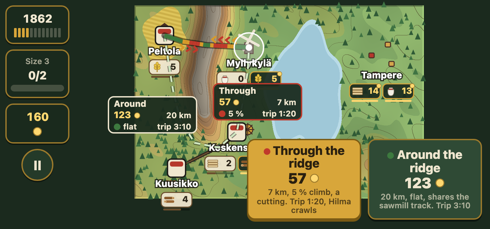

The player decides **the cheap way round or the dear way through**. The
line under the finger is coloured by grade and carries a plate: cost,
length, worst climb, trip time. The alternative is drawn dashed beside it
with its own plate. After the lift, two buttons under the thumb repeat the
numbers and add what they mean: the cutting is short and Hilma crawls on
it; the way round is flat, long, and shares the sawmill's track.

## 3. A train

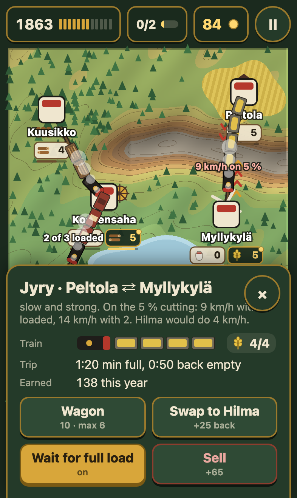 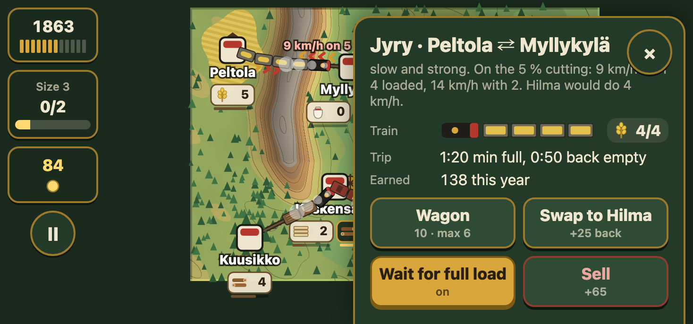

The player decides **wagon, engine, full load, sell**. On the map every
wagon shows its load: logs on a flat wagon, grain in a hopper, the pale door
of a loaded box wagon. A train on a climb carries its speed. The card shows
the consist as pieces, the load as a count, the trip time full and empty,
and what the engine would do on this grade with fewer wagons or with the
other engine, so the swap is a number before it is a purchase.

## 4. A site, tapped

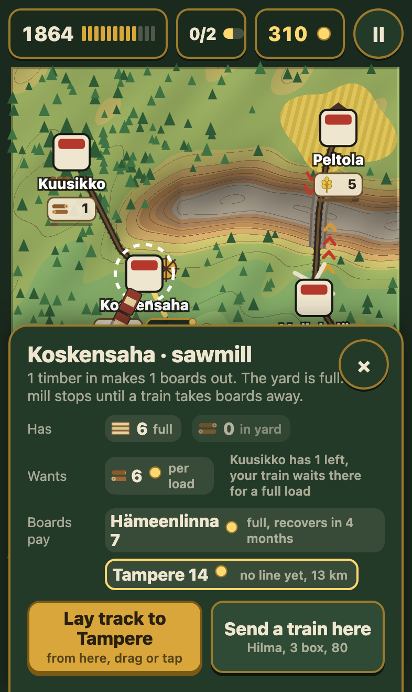 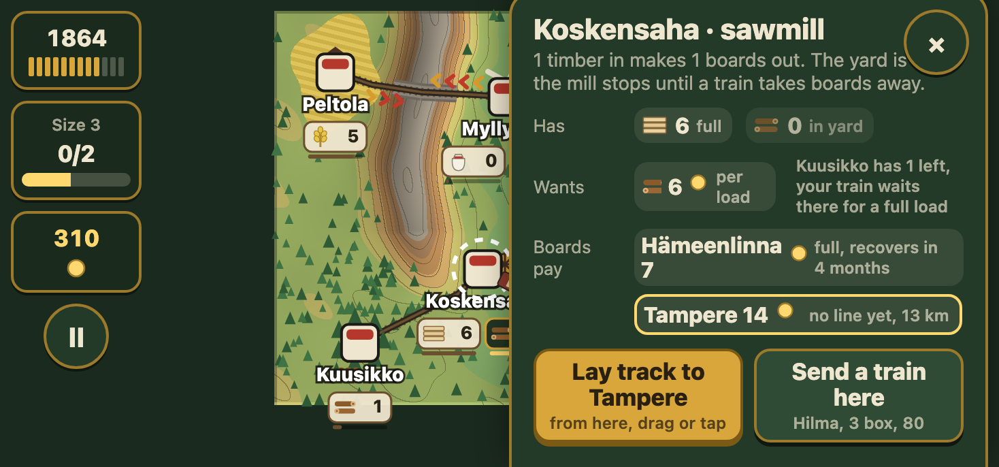

The player decides **where the next train goes**. The sawmill card says
what it has, what it wants and why it is stuck: the yard is full of boards,
the forest has one log left and the timber train is waiting there for a
full load. Every buyer of boards is listed with its price now and its
distance: Hämeenlinna is full and pays 7, Tampere pays 14 and has no line
yet. The first button lays that track from here.

## 5. The year end

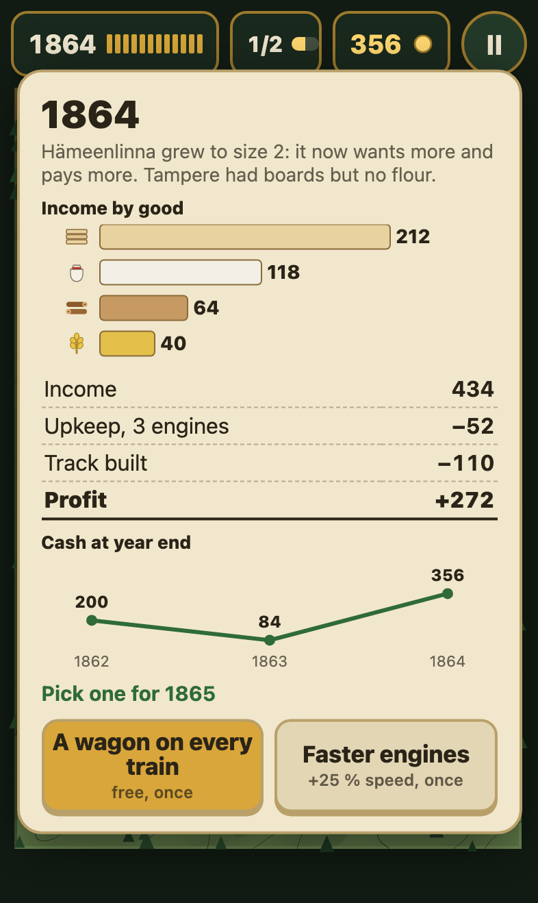 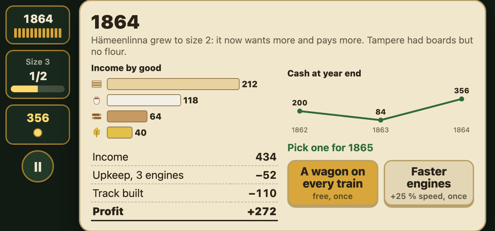

The player decides **the one upgrade for the year**. Income by good is a
bar per good with its icon, so the player sees that boards earn and grain
does not. Cash at each year end is a line, so a bad year is visible as a
dip. Then the costs, the profit, which town grew, and two buttons.

## 6. The network in year four

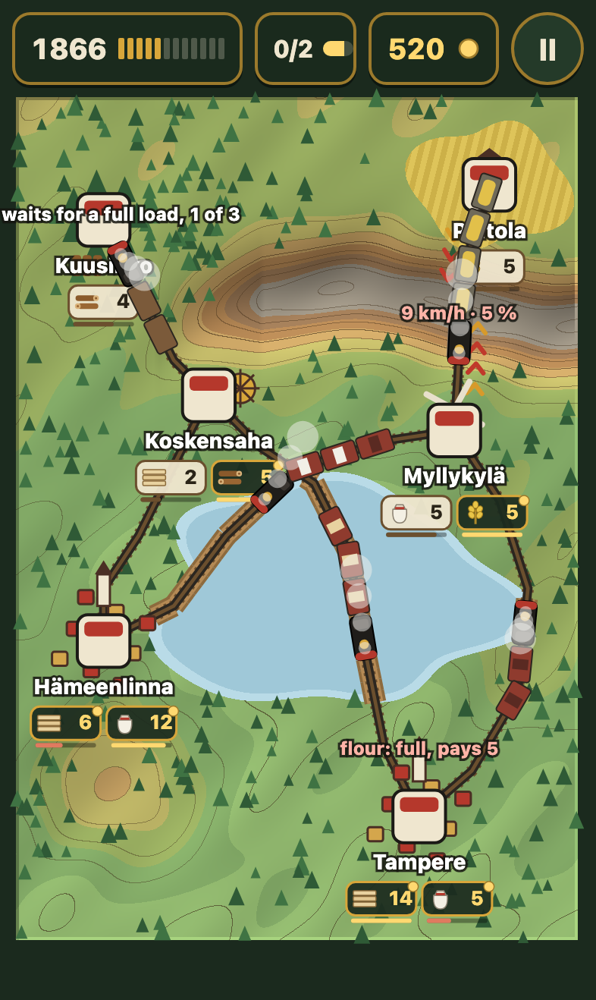 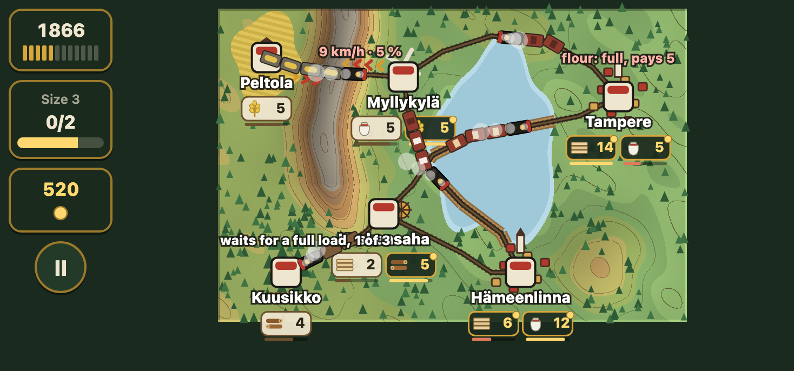

The player decides **which line gets the next train and which town is
full**. Both towns are size 2 with a church. Tampere's flour chip is red:
full, pays 5. Hämeenlinna's boards chip is red. A heavy train crawls on the
cutting at 9 km/h. An empty train waits at the forest for a full load with
one log in three. Every one of these is a reason to act, and every one is
read from the map without a tap.

## What is deliberately absent

Signals, junction design, a tile grid the player can see, a minimap, a
goods overlay, a price map. The map is the overlay.
