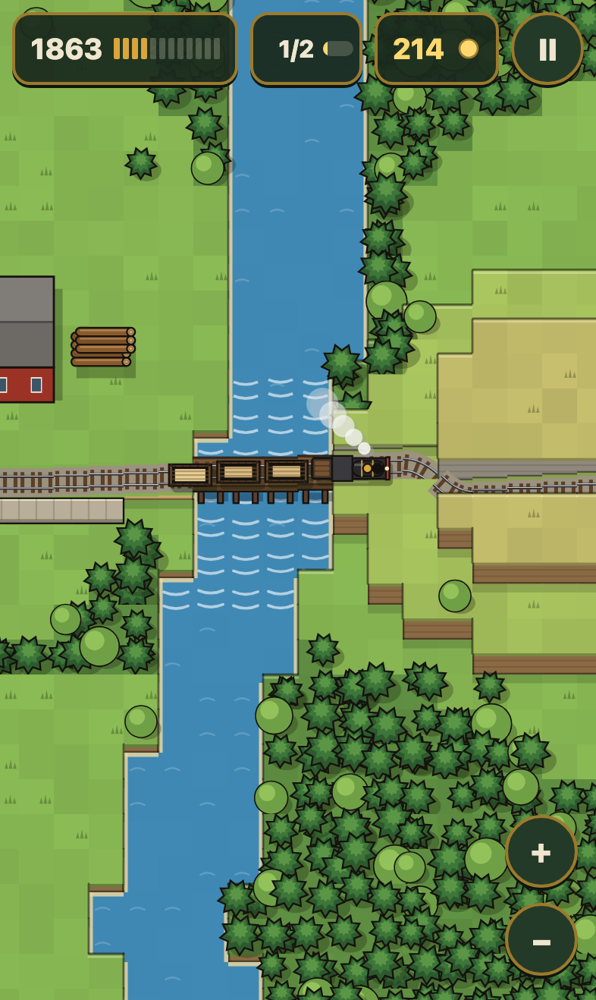
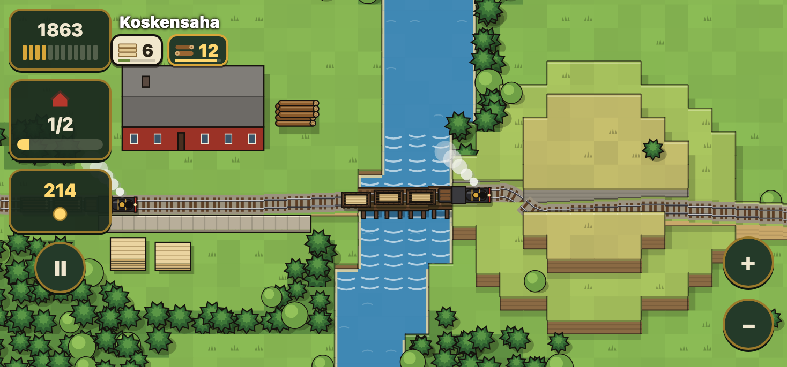
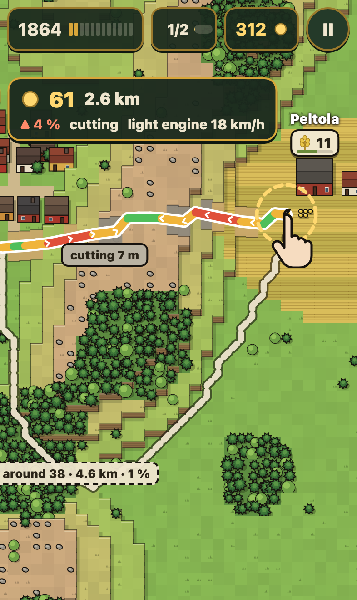
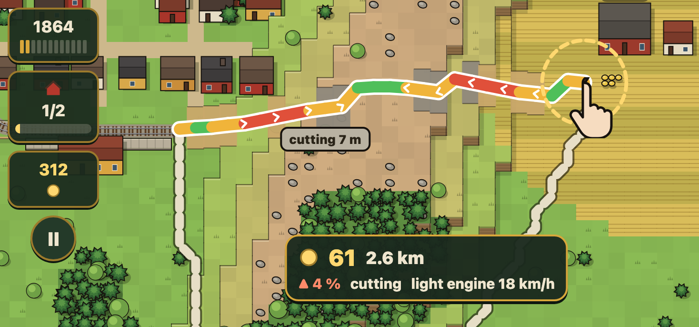
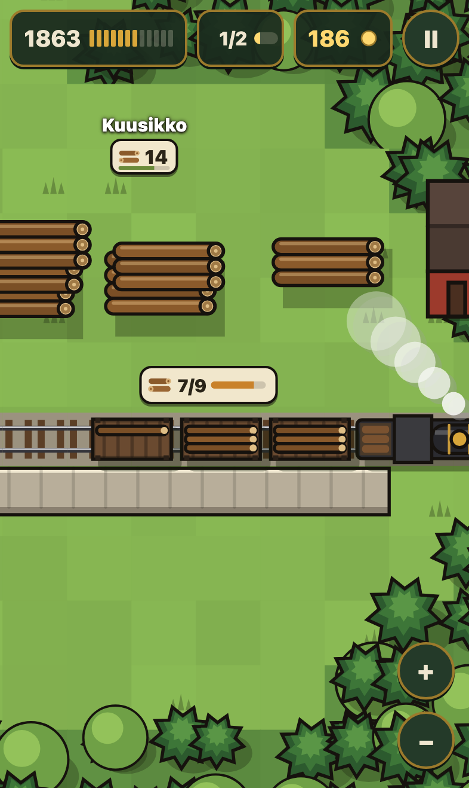
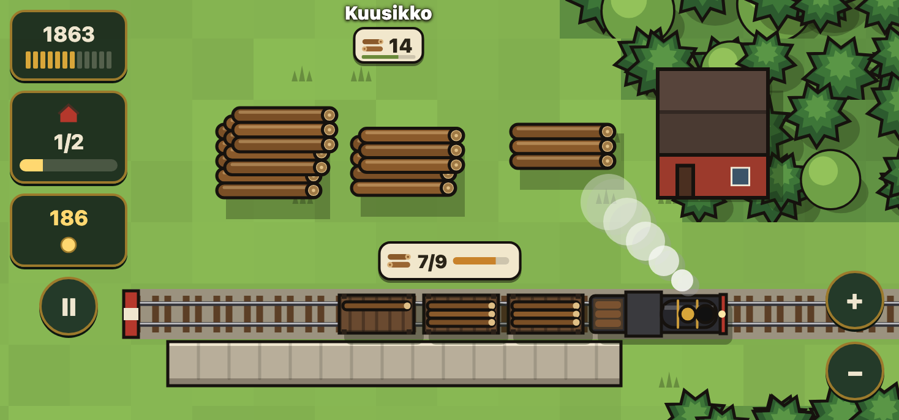
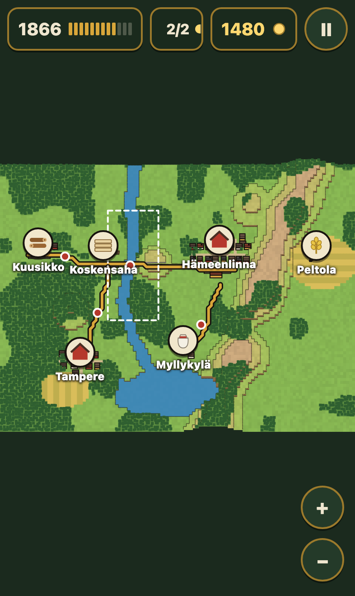
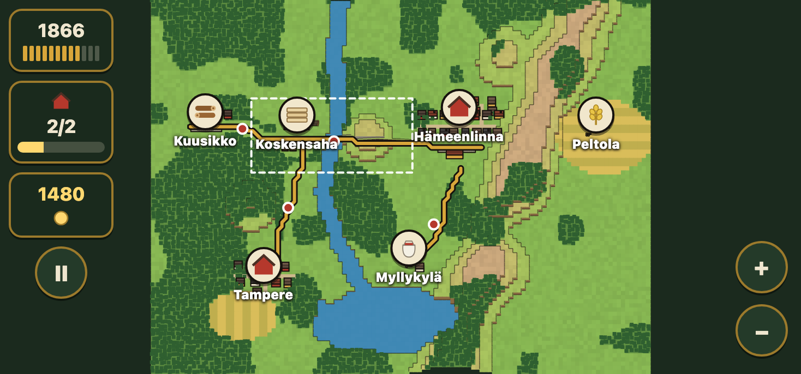

# The top-down look test

Vesa on the 3D build, 2026-10-07: the look he wants is Höyry's graphics
(`~/Repositories/hoyry`, https://vesahyp.github.io/hoyry/), top down and
zoomed in like Prison Architect. The map is big and the player scrolls it.
Hills, rivers and forest must be clear from the drawing itself. This folder
holds four still screens in that style, each on an iPhone 15 in portrait
and landscape. `make topdown` renders them from `scene.html` with
Playwright into `png/`, and makes one sheet per orientation. This is a look
test only. Nothing here is game code.

What comes from Höyry: flat Canvas 2D, one colour for each face, a dark
outline on everything, a soft drop shadow down and to the right, grass
tufts on the tiles, and a 3/4 lean. A box shows its roof and its front
wall, and a terrace of high ground shows its front face.

How height reads without contour lines: the land rises in terraces of
10 m. Each terrace has its own colour: meadow green, light green, dry
olive, then tan heath with stones on the ridge. Each terrace has a front
face of earth and a dark rim on its edges. A cutting is a channel through a
terrace with grey rock walls. An embankment has sand sides. A bridge is a
timber deck on piers over the water.

The map is 120 by 90 tiles. At play zoom a tile is about 23 px, so a
portrait screen shows 17 by 37 tiles. The map is about seven portrait
screens.

## 1. The map, with one line laid

 

Play zoom. Koskensaha, the sawmill by the rapids, has its logs and board
stacks in the yard. The line crosses the river on a bridge and goes through
a cutting in the hill on the east bank. A train with boards is on the
bridge. The chips on each site show what it has (cream) and what it pays
(dark).

## 2. A route drawn over the ridge

 

The player drags from the Hämeenlinna station toward Peltola, the farm
behind the ridge. Under the finger, the route is coloured by grade (green,
amber, red), with chevrons that point uphill. Grey blocks mark where the
rail cuts into the land. The plate shows the cost, the length, the worst
grade, the earthwork and the speed of the light engine on that grade. The
way round through the saddle in the ridge is the dashed line, with its own
cost.

## 3. The station close up

 

Fully zoomed in at Kuusikko, the timber yard at the end of the line. Three
log piles stand beside the track. The train stands at the platform: the
engine with its tender, two full log wagons, and a third wagon that is one
third loaded. The tag over the train shows 7 of 9 loads.

## 4. The whole map

 

Fully zoomed out. The terraces become colour bands, so the ridge, the hills
and the lake still read. The lines are brass. Trains are red dots. The
dashed frame is the area that screen 1 shows. A tap on the map zooms in
there.

## Open questions

- Portrait has empty bands above and below the map in the whole-map view.
  A taller map would fill them.
- The terraces are one tile wide at each step, so a slope looks like
  stairs. A smoother slope is possible but reads less clearly at a glance.
